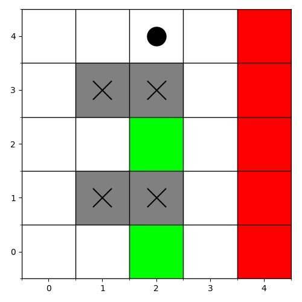
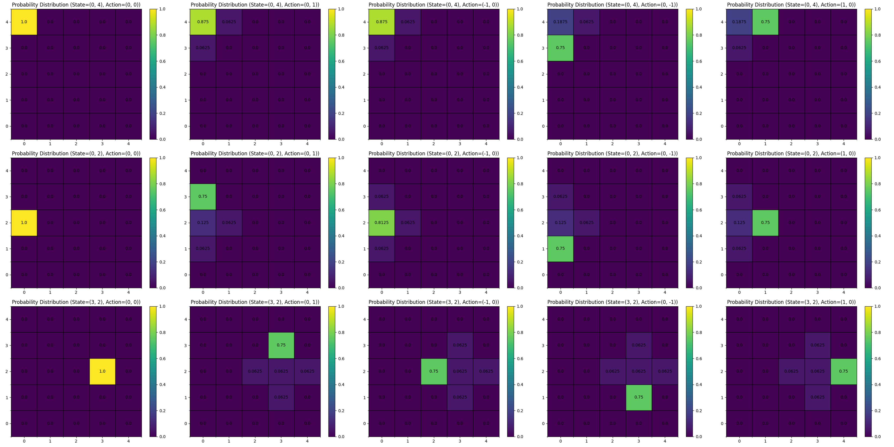
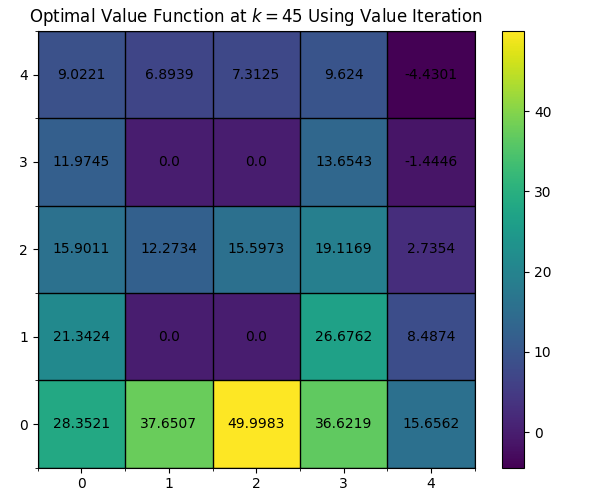
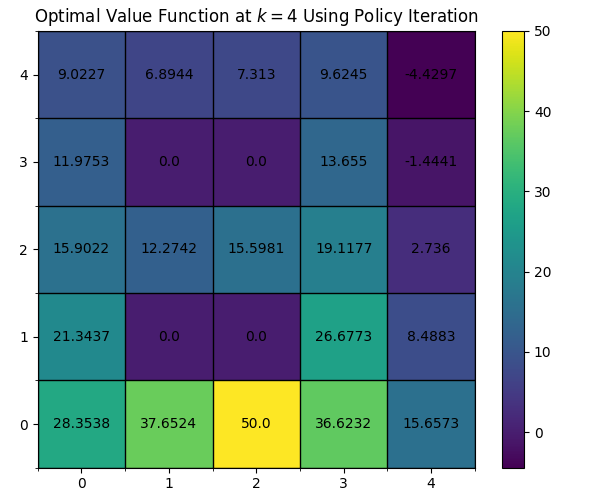
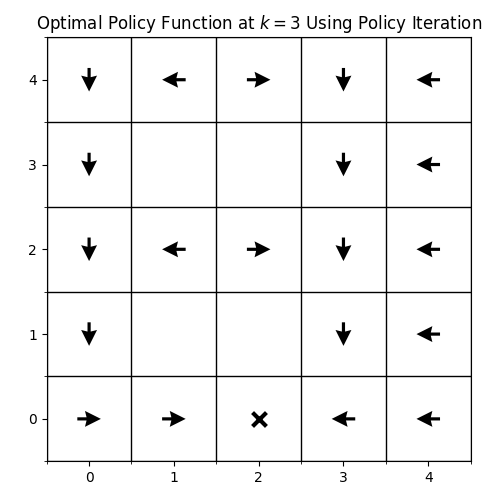
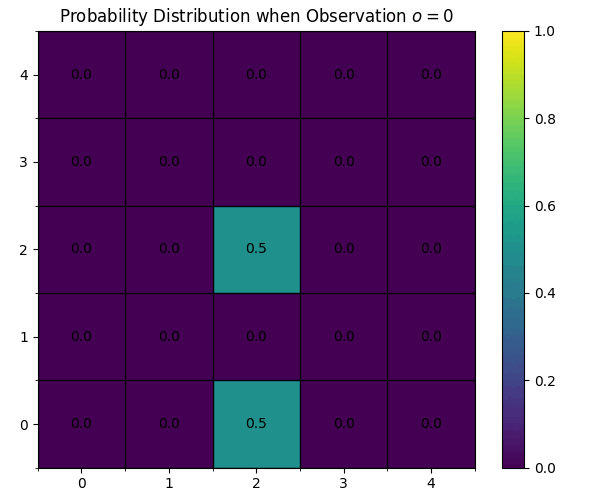

# ECE209AS - Computational Robotics Fall 2022

Git repository for all of my scripts used to solve the weekly challenge problems

## Grid World V2:
- Updated the GridWorld.py function afterwards to revise previous mistakes and brushed up the visualizations (aesthetically more pleasing)
- Individualized each demo into its own runnable script so that each feature is easier to test
### Visualization of World

### Transition Probability Distribution

### Optimal Value
- Value Iteration (Execution Time t=0.030715s):

- Policy Iteration (Execution Time t=0.018148s):

### Optimal Policy

### Observation Probability Distribution

## Grid World:
- First iteration of implementing the gridworld problem from class
- Had several issues with policy iteration and slow computation speeds due to inefficient computation methods not utilizing built-in Python functions
### ASCII Visualization:

### Transition Probabilities:

### Value Iteration: 

## Number Line:
N/A

