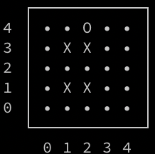
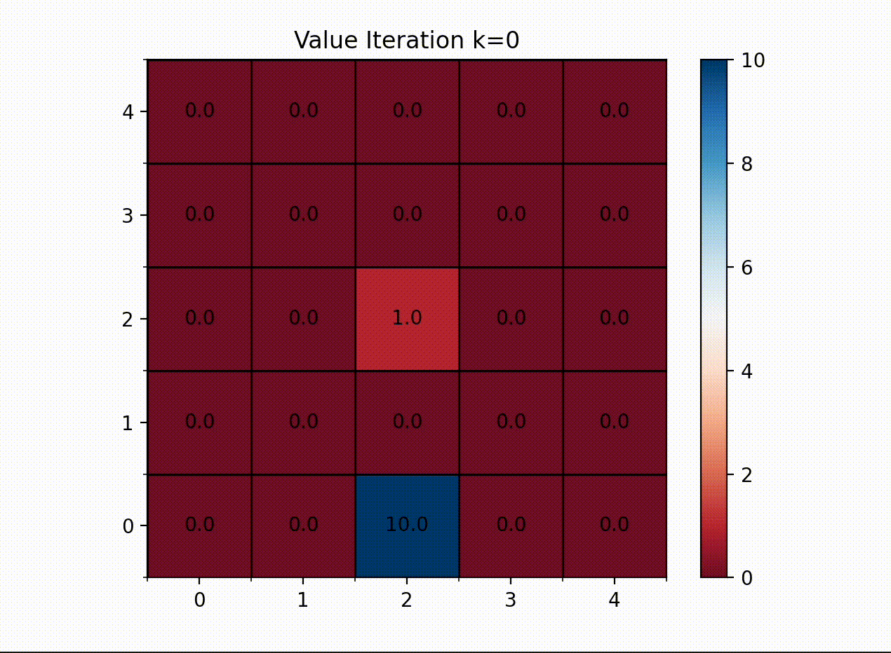

# ECE209AS - Computational Robotics Fall 2022

Git repository for all of my scripts used to solve the weekly challenge problems

## Grid World:

### ASCII Visualization:

### Transition Probabilities:

### Value Iteration: 

## Number Line:
N/A
